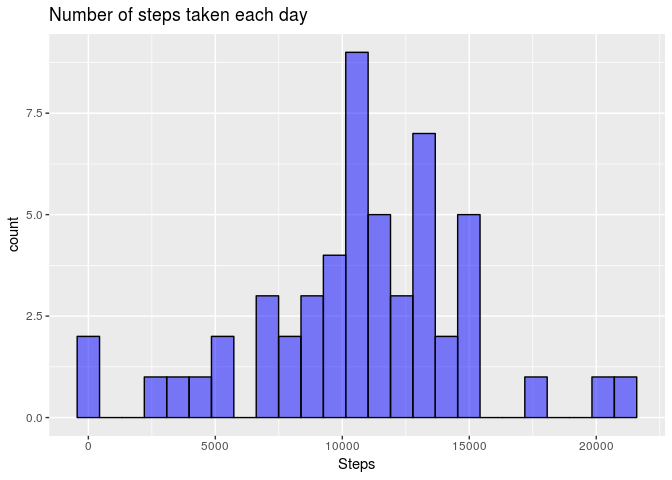
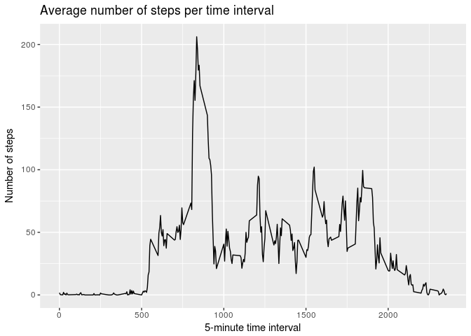
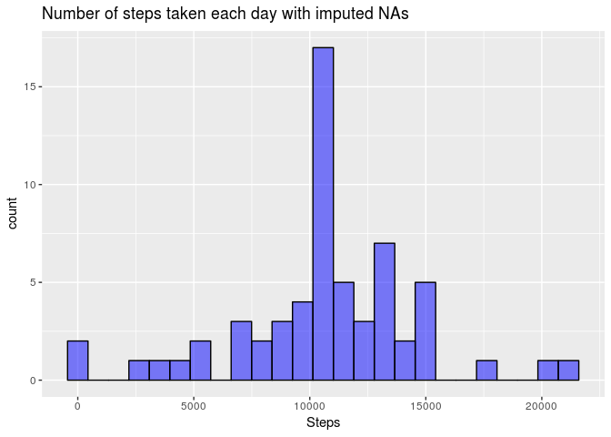
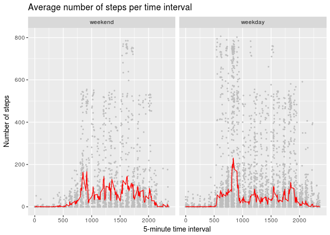

# Reproducible Research: Peer Assessment 1
David Kazaryan aka 1x0r  


## Loading and preprocessing the data

Frst of all, let's load a few libraries.


```r
library(lubridate)
library(dplyr)
library(ggplot2)
library(mice)
```

The dataset is opened directly from the archive:


```r
f <- unz(file.path(getwd(), "activity.zip"), "activity.csv")
amd <- read.csv(f)
```

For the future steps we have to transform the "date" column into POSIXct object:


```r
amd$date <- parse_date_time(amd$date, c("%Y%-%m%-%d%"))
```

## What is mean total number of steps taken per day?

```r
total_steps <- tapply(amd$steps, amd$date, sum)
qplot(total_steps, geom = "histogram", bins = 25, na.rm = TRUE,
      fill = I("blue"), alpha = I(0.5), col = I("black"),
      xlab = "Steps", main = "Number of steps taken each day")
```

<!-- -->


```r
mean_steps <- mean(total_steps, na.rm = TRUE)
median_steps <- median(total_steps, na.rm = TRUE)
```
The mean of the total number of steps taken per day is 10766.19.
The median of the total number of steps taken per day is 10765.

## What is the average daily activity pattern?


```r
steps_per_interval <- tapply(amd$steps, amd$interval, mean, na.rm = TRUE)
ggplot(data = as.data.frame(steps_per_interval), 
       aes(x = unique(amd$interval), y = steps_per_interval)) + 
  geom_line() +
  ggtitle("Average number of steps per time interval") +
  labs(x = "5-minute time interval",
       y = "Number of steps")
```

<!-- -->

```r
max_steps <- which(steps_per_interval == max(steps_per_interval, na.rm = TRUE))
```

104th 5-minute interval contains the maximum number of steps.

## Imputing missing values

```r
missing_count <- sum(rowSums(is.na(amd)) > 0)
```

2304 rows with missing values are in the dataset

The only column tht contains missing values is *steps*. Let's impute them with rounded average number of steps in the corresponding 5-minutes interval:


```r
imp_amd <- amd %>% 
      group_by(interval) %>% 
      mutate(steps = replace(steps, is.na(steps), round(mean(steps, na.rm = TRUE)))) %>% 
      ungroup %>%
      as.data.frame
```

*imp_amd* is the new *data.frame* with imputed missing values. Let's plot a histogram with *imp_amd*.


```r
imp_total_steps <- tapply(imp_amd$steps, imp_amd$date, sum)
qplot(imp_total_steps, geom = "histogram", bins = 25, na.rm = TRUE,
      fill = I("blue"), alpha = I(0.5), col = I("black"),
      xlab = "Steps", main = "Number of steps taken each day with imputed NAs")
```

<!-- -->

Histogram visibly differs from the histogram with missing values omitted.


```r
imp_mean_steps <- mean(imp_total_steps)
imp_median_steps <- median(imp_total_steps)
```

The mean of the total number of steps taken per day is 10765.64.
The median of the total number of steps taken per day is 10762.00.

Mean and median values slightly changed from their previous values calculated from the dataset with ignored NAs.

## Are there differences in activity patterns between weekdays and weekends?

I introduced a new variable with two levels: weekends and weekdays. By default my Ubuntu has Russian language set up, so weekend abbreviations look like *Сб* for *S*, Saturday and *Вс* for *U*, Sunday.

```r
imp_amd$weekday <- factor(weekdays(imp_amd$date, abbreviate = TRUE) %in% c("Сб", "Вс"), 
                          levels = c(TRUE, FALSE), labels = c("weekend", "weekday"))

ggplot(imp_amd, aes(x = interval, y = steps)) + geom_point(size = 0.5, color = "gray") +
  facet_grid(. ~ weekday) +
  stat_summary(fun.y = mean, geom = "line", color = "red") +
  ggtitle("Average number of steps per time interval") +
  labs(x = "5-minute time interval",
       y = "Number of steps")
```

<!-- -->

Person activity in weekends seem to start later than on weekdays (probably due to the lack of necessity in getting up to go to work or school).
